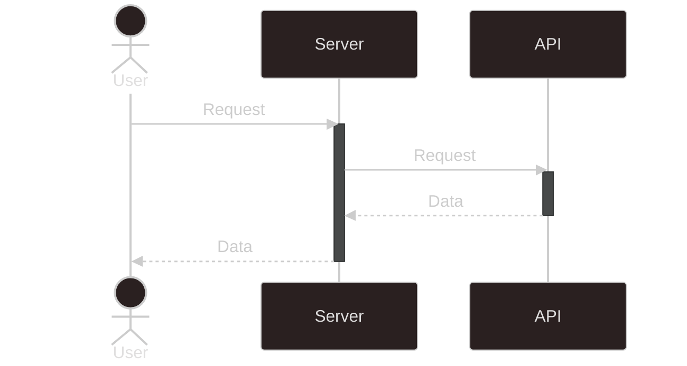

# 簡易仕様書

### 作者

小池和輝

### アプリ名

fenrir-coding-test

#### コンセプト

店舗情報をカードで並べて表示

#### こだわったポイント

- カードにホバーしているときのリングエフェクト
- ダークモード対応
- 緯度経度だけでなく現在地の住所を表示

### 公開したアプリの URL

https://fenrir-coding-test.vercel.app/

### 該当プロジェクトのリポジトリ URL（GitHub,GitLab など Git ホスティングサービスを利用されている場合）

https://github.com/keufcp/fenrir-coding-test

## 開発環境

Visual Studio Code `v1.99.2`

### 開発環境

```
Node    v22.12.0
React   v19.1.0
Next.js v15.3.0
```

### 開発言語

TypeScript

### テーブル定義(ER図)などの設計ドキュメント（ウェブアプリ）

APIキー等の機密情報を秘匿する設計



### 開発環境構築手順(ウェブアプリ)

1. リポジトリをクローンする
1. `.env.template`を元に環境変数を設定する
   1. [HotpepperグルメサーチAPI](http://webservice.recruit.co.jp/HotPepper/)
   1. [Hotpepper検索用ディナー予算マスタAPI](https://webservice.recruit.co.jp/doc/hotpepper/reference.html#:~:text=desc%3E%0A%C2%A0%20%3C/shop%3E-,%E6%A4%9C%E7%B4%A2%E7%94%A8%E3%83%87%E3%82%A3%E3%83%8A%E3%83%BC%E4%BA%88%E7%AE%97%E3%83%9E%E3%82%B9%E3%82%BFAPI,-%E3%83%AA%E3%82%AF%E3%82%A8%E3%82%B9%E3%83%88URL)
   1. [Yahoo!リバースジオコーダAPI](https://developer.yahoo.co.jp/webapi/map/openlocalplatform/v1/reversegeocoder.html)
1. プロジェクトディレクトリで下記コマンドを実行

   ```bash
   npm install

   npm run dev
   ```

1. ブラウザで `http://localhost:3000` にアクセスする

## 動作対象端末・OS

### 動作対象OS

- Windows 10/11 (実機確認)
- Android 12 (実機確認)

> [!NOTE]
> 上記以外のOSについては実機確認していません

### 動作対象ブラウザ

- Google Chrome
- Microsoft Edge
- Mozilla Firefox

## 開発期間

## アプリケーション機能

### 機能一覧

<!-- - レストラン検索：ホットペッパーグルメサーチAPIを使用して、現在地周辺の飲食店を検索する。
- レストラン情報取得：ホットペッパーグルメサーチAPIを使用して、飲食店の詳細情報を取得する。
- 電話アプリ連携：飲食店の電話番号を電話アプリに連携する。
- 地図アプリ連携：飲食店の所在地を地図アプリに連携する。 -->

レストラン検索

- 現在地情報をGeolocationAPIを用いて取得
  - 同時に現在地の住所も表示する
- 取得した緯度経度情報を元にホットペッパーグルメサーチAPIを用いて飲食店の詳細情報を取得する
  - API情報は各ページごとに取得
    - 検索件数が多くなったときの読み込み遅延対策

### 画面一覧

<!-- - 検索画面 ：条件を指定してレストランを検索する。
- 一覧画面 ：検索結果の飲食店を一覧表示する。 -->

- 全般: レスポンシブデザイン対応
- 検索画面: 現在地からの半径，予算で絞り込みが可能
- 一覧画面:
  - API取得情報から先頭10件を表示
  - ページングに対応し，各ページごとにデータ取得
  - 店舗画像がない場合は専用のアイコンを表示
- 店舗詳細画面:
  - モーダルにて店舗詳細画面を表示
  - 各項目をアイコンで表示し，その横に説明文を表示
  - 店舗画像がない場合は専用のアイコンを表示

### 使用しているAPI, SDK, ライブラリなど

#### API

- ホットペッパーグルメサーチAPI
- ホットペッパー検索用ディナー予算マスタAPI
- Yahoo!リバースジオコーダAPI

#### ライブラリ等

- dotenv
- ESLint
- Prettier
- shadcn/ui
- tailwindcss

### 技術面でアドバイスして欲しいポイント
